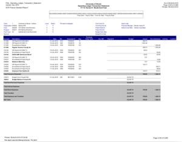

pdf2data
========

Have some tabluar data locked away in PDF format? Like the financial information at my
esteemed place of current employment, which looks roughly like this:

`Tabula <https://tabula.technology/>`__ not plausible for the volume of
information you're needing to extract? (Thousands of pages in my case.) This
package may be what you're looking for. I should note that this is
a simple tool aimed at very structured data.  Tabula can handle *far* messsier
situations than this package. Misaligned cell heights?  Word-wrapped cells?
Spanning cells?  You're better off with Tabula. Computer-generated report
PDFs that urgently want to be in a SQLite database? You've come to the right
place.

Reading UIUC Financials
-----------------------

If you came here looking to read financial statements at UIUC, there's a page
`just for you <reading-uiuc-financial-statements.md>`__.

Package Overview
----------------

This package builds on `pdfminer <https://github.com/pdfminer/pdfminer.six>`__ to make it
easy to absorb computer-generated tabular data in PDF form and produce JSON-like lists of
row dictionaries. The basic workflow is as follows:

.. code:: python

    # identify top of table
    top_y0 = find_attr_group_matching(
            ["Last Name", "First Name"], "y0", page_it.lines)

    # extract text snippets making up table body
    table_lines = [l for l in page_it.lines if l.y0 < top_y0]

    # extract header text snippets
    headers = [l for l in page_it.lines if abs(l.y0 - top_y0) < 5]

    # extract table
    rows = find_row_table(headers, table_lines)
    rows = merge_overlapping_rows(rows, "y0", "y1")

This will leave ``rows`` to be a data structure roughly like the following:

.. code:: js

    {'Amount ': TL('           60.00 '), 'Last Name': TL('Lidstad'), 'Address': TL('62\xa0Mississippi\xa0River\xa0Blvd\xa0N'), 'First Name': TL('Dick\xa0&\xa0Peg'), 'City': TL('Saint\xa0Paul'), 'State': TL('MN'), 'Zip': TL('55104'), 'Occupation': TL('retired'), 'Date': TL('10/12/2012')}
    {'Amount ': TL('           60.00 '), 'Last Name': TL('Strom'), 'Address': TL('1229\xa0Hague\xa0Ave'), 'First Name': TL('Pam'), 'City': TL('St.\xa0Paul'), 'State': TL('MN'), 'Zip': TL('55104'), 'Date': TL('9/12/2012')}
    {'Amount ': TL('           60.00 '), 'Last Name': TL('Seeba'), 'Address': TL('1399\xa0Sheldon\xa0St'), 'First Name': TL('Louise\xa0&\xa0Paul'), 'City': TL('Saint\xa0Paul'), 'State': TL('MN'), 'Zip': TL('55108'), 'Occupation': TL('BOE'), 'Employer': TL('City\xa0of\xa0Saint\xa0Paul'), 'Date': TL('10/12/2012')}
    {'Amount ': TL('           60.00 '), 'Last Name': TL('Schumacher\xa0/\xa0Bales'), 'First Name': TL('Douglas\xa0L.\xa0/\xa0Patricia\xa0948\xa0County\xa0Rd.\xa0D\xa0W'), 'City': TL('Saint\xa0Paul'), 'State': TL('MN'), 'Zip': TL('55126'), 'Date': TL('10/13/2012')}
    {'Amount ': TL('           75.00 '), 'Last Name': TL('Abrams'), 'Address': TL('238\xa08th\xa0St\xa0east'), 'First Name': TL('Marjorie'), 'City': TL('St\xa0Paul'), 'State': TL('MN'), 'Zip': TL('55101'), 'Occupation': TL('Retired'), 'Employer': TL('Retired'), 'Date': TL('8/8/2012')}

See `this demo <example/demo.py>`__ for a minimal, fully functional example.
There is some documentation in the `source code <pdf2data/pdf.py>`__.  In
addition, there are some (sparsely documented) facilities for inserting the
obtained data into a SQLite3 database and the full script I use to make my
financial info digestible.

The package is Python 3-only. Install using::

    pip install pdf2data

https://github.com/inducer/pdf2data

Copyright 2019 Andreas Kloeckner

Released under the MIT License

In terms of support, if this doesn't do what you need, you're likely to be on
your own. I'm happy to take patches, but I'm unlikely to have to time to fix
your use case.
